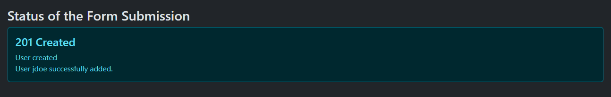
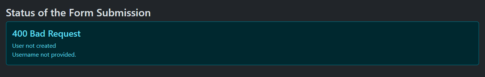
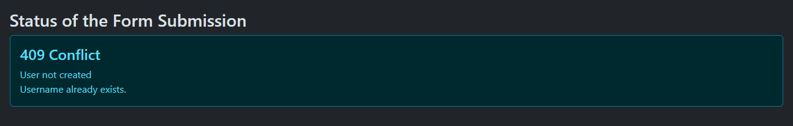

[](https://classroom.github.com/a/oK5xeBSX)
# Übung 8 – REST & AJAX

HYP2UE_T1 Hypermedia 2 Serverseitige Programmierung | 13.05.2024 | Wolfgang Hochleitner | Abgabe

In dieser Applikation sollen ein REST-Server und ein Client, der mittels AJAX einen asynchronen Request an diesen schickt, implementiert werden. Der Client enthält ein Formular zum Eintragen von Username, Name und E-Mail-Adresse. Beim Absenden wird mittels AJAX die Route `POST /adduser` am REST-Server asynchron aufgerufen und bei Erfolg ein User-Eintrag in der Datenbank hinzugefügt. Die API gibt einen Statuscode mit einer JSON-Antwort zurück, die auf der Clientseite direkt nach dem Absenden ohne Reload angezeigt werden soll.

## Den Startercode zum Laufen bringen

Zunächst muss der Startercode in den beiden Verzeichnissen `ajax-client` und `rest-server` lauffähig gemacht werden. Es handelt sich dabei um zwei auf
*fhooe/router-skeleton* basierende Projekte. Folgende Dinge sind zu tun.

### Dependencies mit Composer installieren

Starten Sie zunächst eine Bash-Shell im `webapp` Container:

```bash
docker exec -it webapp /bin/bash
```

Wechseln Sie in den Unterordner `t1-ue08-YourTeamName` und dann in jeden der beiden Unterordner lassen Sie Composer die Dependencies installieren:

```bash
cd t1-ue08-YourTeamName/
cd rest-server/
composer install
cd ../ajax-client/
composer install
```

### Basispfade anpassen

Passen Sie im ersten Schritt den Basispfad in beiden Projekten jeweils in `public/index.php` auf das Verzeichnis ihres Teams an, damit die geroutete Applikation korrekt funktioniert.

Rufen Sie http://localhost:8080/t1-ue08-YourTeamName/ajax-client/public/ bzw. http://localhost:8080/t1-ue08-YourTeamName/rest-server/public/ auf, um dies zu überprüfen. Wenn Sie beim Client die Index-Seite mit dem Formular und beim Server die Übersicht mit der Route für CreateDB sehen, funktioniert alles korrekt.

Sollte eine Fehlermeldung über fehlende Rechte zum Schreiben der Log-Datei angezeigt werden, so erteilen Sie dem gesamten Ordner `t1-ue08-YourTeamName` und allen Unterordnern mit folgendem Befehl entsprechende Rechte:

```bash
chmod -R 777 .
```

### Datenbank des REST-Servers erzeugen

Um ihre Datenbank mit Beispieldaten zu befüllen, rufen Sie die Route `/createdb` beim REST-Server auf. Sie erzeugt zunächst die Datenbank "ue08_users", legt dann eine Tabelle "user" and und fügt in diese fünf Beispieluser\*innen ein. Die Tabelle mit den Beispieldaten sieht wie folgt aus:

| id (PK) | username    | name           | email                  |
|---------|-------------|----------------|------------------------|
| 1       | tee343      | Tegan Benjamin | tegan@benjamin.ca      |
| 2       | LWhitney    | Lance Whitney  | lancewhitney@gmail.com |
| 3       | o_weber     | Odette Weber   | odette_w@yahoo.com     |
| 4       | GhostWriter | Simon Terry    | ghost343@mail.com      |
| 5       | DarkRider   | Ryder Stewart  | me@darkrider.cc        |

## Den REST-Server umsetzen

Nachdem die beiden Basisprojekte nun laufen, kann als Erstes mit der Umsetzung des REST-Servers begonnen werden. Anpassungen sind zunächst in `public/index.php` für die Route notwendig. Das Hinzufügen von User\*innen und das Generieren von JSON-Antworten geschieht in der Klasse `src/HYP2UE08/UserManager.php`.

### Route `POST /adduser` anpassen

Der REST-Server kennt (neben `GET /createdb`) nur eine Route, nämlich `POST /adduser`. Diese Route fügt eine\*n neue\*n User\*in hinzu und gibt einen Statuscode mit einer JSON-Antwort zurück.

Legen Sie ein Objekt der Klasse `UserManager` an und rufen Sie darauf `addUser()` auf. Die Methode hat keine Parameter, die Daten für Username, Name und E-Mail-Adresse kommen aus der POST-Payload.

### Klasse `UserManager`

Diese Klasse übernimmt das Hinzufügen von neuen User\*innen. Im Konstruktor wird die Datenbank initialisiert und eine Eigenschaft für den Content-Type auf "application/json" gesetzt. Sie kennzeichnet das Format der Response.

#### Methode `addUser()`

Diese Methode wird in der Route aufgerufen und fügt eine\*n neue\*n User\*in hinzu. Die Methode fragt zunächst die Werte für Username, Name und E-Mail-Adresse aus `$_POST` ab.

Bevor ein neuer Eintrag hinzugefügt werden kann, müssen zwei Überprüfungen stattfinden:

- Ist der Eintrag für den Username leer?
  - Falls ja, wird eine Response mit Statuscode 400 BAD REQUEST erzeugt und eine JSON-Response, die über den (fehlgeschlagenen) Status des Einfügens informiert.
- Existiert bereits ein\*e User\*in mit diesem Username in der Datenbank?
  - Falls ja, wird eine Response mit Statuscode 409 CONFLICT erzeugt und eine JSON-Response, die über den (fehlgeschlagenen) Status des Einfügens informiert.
  - Die Überprüfung selbst wird in der Methode `userExists(string $username)` durchgeführt.

Treffen beide Abfragen nicht zu, wird der neue Eintrag mit der Methode `insertUser(string $username, string $name, string $email)` in die Datenbank geschrieben. Die Methode gibt `true` zurück, wenn dies erfolgreich war oder `false` im Fehlerfall.

Das Ergebnis der Einfügeoperation bestimmt den Statuscode und die JSON-Antwort:

- War der Eintrag erfolgreich, wird eine Response mit Statuscode 201 CREATED erzeugt und eine JSON-Response, die über den (erfolgreichen) Status des Einfügens informiert.
- War der Eintrag nicht erfolgreich, wird eine Response mit Statuscode 500 INTERNAL SERVER ERROR erzeugt und eine JSON-Response, die über den (fehlgeschlagenen) Status des Einfügens informiert.

##### Die JSON-Antwort

Die von `addUser()` erzeugte JSON-Antwort hat immer die zwei Felder `status` und `message`. Ersteres informiert über den Ausgang der Operation, z.B. "User not created." Letzteres gibt einen detaillierten Grund an, z.B. "Username not provided.":

```json
{
    "result": "User not created.",
    "message": "Username not provided."
}
```

Die Methode `showResponse(int $statusCode, ?array $content)` gibt die Response im JSON-Format aus. Der Parameter `$content` muss als assoziatives Array übergeben werden. Um die obige Struktur zu erhalten, müssen die Schlüssel "result" und "message" mit entsprechenden Werten enthalten sein.

## Den AJAX-Client umsetzen

Der Client stellt eine Anfrage an den REST-Server, die eine\*n neue\*n User\*in einfügen soll. Diese Anfrage geschieht asynchron mittels AJAX, wird als in JavaScript ausgeführt. Das Ergebnis ist die vom Server erzeugte JSON-Antwort im obigen Format, zusammen mit einem Statuscode. Diese Information soll auf der Seite des Formulars ohne Neuladen der Seite angezeigt werden.

### Die Datei `main.js`

Die gesamte Arbeit des Clients wird in `public/js/main.js` umgesetzt.

#### Den Request absetzen

Zunächst wird ein `XMLHttpRequest`-Objekt erzeugt und das Formular-Element abgefragt. Dann wird ein Event-Handler, der auf den `submit`-Event hört, hinzugefügt. Wird das Formular abgeschickt, wird eine Methode (z.B. `sendAJAXRequest(event)`) aufgerufen, die den Request asynchron absetzt.

Abgesetzt wird ein POST-Request. Mithilfe eines `FormData`-Objekts können die Daten aus dem Formular zusammengefasst und beim Absenden als Payload übergeben werden.

Wichtig ist, dass der korrekte Request-Header `Accept` mit dem Wert "application/json" mitgeschickt wird, da der Server nur dieses Format liefert (und sonst den Statuscode 406 zurückgibt).

Ein Event-Handler für den `load`-Event ruft eine weitere Methode (z.B. `handleResponse()`) auf, die sich um die Verarbeitung des Ergebnisses kümmert.

#### Das Ergebnis verarbeiten

Nachdem das Ergebnis eingetroffen ist, können der Statuscode und der Text zum Statuscode vom `XMLHttpRequest`-Objekt abgefragt und zusammen mit den Daten aus der JSON-Antwort entnommen und in das Element mit der ID "status" eingefügt werden.

Die Abbildungen zeigen ein erfolgreiches Einfügen und eine fehlgeschlagene Operation.

|  |
|:-----------------------------------------------------------------------------------------------------------------------:|
|                     **Wurde ein\*e User\*in erfolgreich eingefügt, wird Status 201 zurückgegeben.**                     |

|  |
|:---------------------------------------------------------------------------------------------------------:|
|                     **Wurde kein Username angegeben, wird Status 400 zurückgegeben.**                     |

|  |
|:----------------------------------------------------------------------------------------------------------:|
|                     **Existiert ein Username bereits, wird Status 409 zurückgegeben.**                     |

## Tipps und Richtlinien

- Um zunächst nur die REST API zu testen, kann der AJAX-Client auch ohne implementierte JavaScript-Datei verwendet werden. Dazu einfach das Formular ausfüllen und absenden. Dies ruft die POST-Route mit den Daten aus dem Formular auf. Es empfiehlt sich jedoch, die Überprüfung auf den korrekten Content-Type in `showResponse()` zunächst zu deaktivieren, um ein Ergebnis zu sehen, das nicht Statuscode 406 lautet.
- Bei Fragen oder Problemen zur Aufgabe eröffnen Sie ein Issue in ihrem Repository.